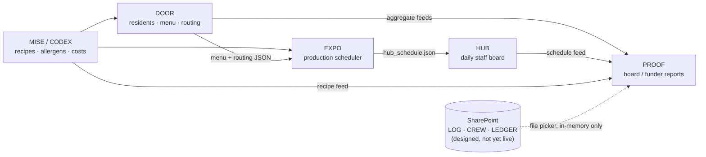

# HOUSE → Microsoft 365 / SharePoint Integration Brief

**For:** CONC IT
**From:** Jason Kennedy — kitchen operations
**Date:** 2026-07-07
**Status:** Request. Stages 1–2 below are the near-term ask; Stages 3–5 are the roadmap so the early setup choices fit the destination.
**Companion:** `SHAREPOINT_IT_BRIEF.html` in this repo is the same content as a printable/presentable one-pager.

---

## 1. Summary

CONC's kitchen operation runs on **HOUSE** — five in-house browser apps that plan, route, and report shelter catering across the Bloor and Rexdale kitchens. They were built deliberately on infrastructure the organization already owns: single HTML files, no servers, no vendors, no licence costs.

Today the apps are hosted on GitHub Pages and move their shared data through GitHub, under a personal account. We want to bring the **data** home to CONC's Microsoft 365 tenant in stages, with app **hosting** as the final step.

Most of the groundwork already exists inside the apps — two of them ship complete Microsoft sign-in + Graph API clients that are dormant only because no Entra app registration exists yet, and a third was written with named "swap to SharePoint here" seams. The first two stages therefore need only standard M365 administration:

1. **A governed SharePoint document library** (folders, permission groups, retention labels, version history) so PROOF, DOOR, and EXPO can start putting files on the shared drive immediately.
2. **One Microsoft Entra app registration** (single-page application, delegated Graph permissions, no client secret) so the apps can read/write those files directly as the signed-in user.

Nothing in this plan asks IT to run, host, or maintain software. The kitchen team maintains the apps; IT owns tenancy, identity, and governance.

---

## 2. The big picture

### The apps

| App | Repo | What it does | Who uses it |
|---|---|---|---|
| **DOOR** | `conc-kitchen-door` | Resident registry, meal routing, plating sheets, allergen compliance. Upstream source of the menu and resident counts. | Floor staff, supervisors |
| **EXPO** | `conc-kitchen-expo` | Production scheduler — turns the 4-week menu into multi-site cook/prep/send schedules. | Production planner |
| **HUB** | `conc-kitchen-hub` | Staff-facing daily whiteboard (phones/tablets/print) — renders the schedule EXPO publishes. | Everyone on shift |
| **MISE / CODEX** | `conc-recipe-hub` | Recipe library; publishes the recipe/allergen/cost feed the other apps consume. | Cooks, recipe author |
| **PROOF** | `conc-kitchen-proof` | Board/funder reporting — re-slices operational data into any funder's template. Aggregates only. | Management, director |
| Portal | `conc-kitchen-house` | Landing page linking the apps (this repo). | Everyone |

### How data flows



Each arrow is a small JSON file committed to a GitHub repository and served over GitHub Pages. Staff enter data once (in DOOR or CODEX) and everything downstream regenerates — that "enter once, generate everything" property is the core of the system and is preserved by every stage below.

### Where things live today → where they're going

| Layer | Today | Target (stage) |
|---|---|---|
| App hosting | GitHub Pages, personal account (`kennedyjasondavid-eng.github.io`) | Org-controlled hosting — **Stage 5 (last)** |
| Cross-app data transport | JSON files pushed to GitHub via personal access tokens, read over public Pages URLs | Stays on GitHub through Stages 1–2; candidates move to M365 in Stage 3 |
| Per-user working state | Browser `localStorage` on each device (plus one IndexedDB store in EXPO) | Shared, Graph-backed state at the already-built seams — **Stage 3** |
| File outputs (xlsx, PDF, snapshots) | Manual browser downloads; some pushed to GitHub | SharePoint document library — **Stage 1 (sync client), Stage 2 (direct Graph writes)** |
| Sensitive data | Resident registry lives only in the DOOR browser; everything published is aggregate. PROOF's sensitive tier (staff certs, incidents, spend) is *specified* for SharePoint but not yet stood up | Governed SharePoint workbooks — **Stage 1** |
| Credentials | GitHub fine-grained PATs pasted per browser (plaintext localStorage); a PIN gate on the portal | Entra ID sign-in via MSAL — **Stage 2 enables, Stage 4 completes** |
| Working folders | Repo clones already live in OneDrive-synced folders (`OneDrive - CHRISTIE OSSINGTON NEIGHBOURHOOD CENTRE\…`) | Already on M365 — unchanged |

### The data-classification story (worth 60 seconds)

- **Resident data never leaves the DOOR browser.** Published artifacts (`registry_summary.json`, routing counts) are aggregates. Nothing resident-identifying is on GitHub.
- **PROOF is deliberately a "lens, never a vault":** it reads the sensitive workbooks from SharePoint into memory for one render, prints suppressed aggregates (small-cell suppression, k≈5), and forgets the rows on reload. It never persists sensitive data to localStorage, GitHub, or disk. The security perimeter for that data is *designed to be M365* — which is exactly why Stage 1 matters.
- Everything that IS on GitHub today (menus, schedules, recipes, costs) is operational, non-personal data.

---

## 3. SharePoint already touches HOUSE

This is not a greenfield ask — the integration surface already exists:

1. **~148 recipe links in HUB** point at Excel recipe cards in `conctoronto.sharepoint.com/sites/Kitchen/Shared Documents/Bloor/Recipes/` (plus a Recipe Booklet Word link on the same site). Staff already follow HUB → SharePoint every day.
2. **DOOR's settings** carry a SharePoint base URL (default `https://conctoronto.sharepoint.com`) and a pilot output folder deep-link under `sites/Kitchen/Shared Documents/Dietary Restrictions - Rexdale Catering/`.
3. **HUB and CODEX ship complete, tested Microsoft sign-in + Graph clients** (MSAL 2.38, single-page-app flow, tokens cached in sessionStorage, no client secrets anywhere). HUB's feature syncs kitchen site profiles; CODEX's uploads recipe archives and runs a shared recipe review queue. Both are dormant awaiting a Client ID — CODEX's repo has carried a written provisioning request since 2026-06-20 (`conc-recipe-hub/docs/CODEX_U13_SHAREPOINT_CLIENT_ID_REQUEST_2026-06-20.md`).
4. **DOOR was written with named "Phase 5" seams** — three isolated persistence functions whose comments read "swap this implementation for a SharePoint write via Microsoft Graph API — call sites don't change," and staff-facing copy that already promises "automatic archiving to SharePoint will be enabled in Phase 5."
5. **PROOF's sensitive tier is fully specified as SharePoint workbooks** — `LOG.xlsx`, `CREW.xlsx`, `LEDGER.xlsx` with exact columns, dropdowns, permission groups, and retention labels, documented in `conc-kitchen-proof/SHAREPOINT_SETUP_CHECKLIST.md` and `GOVERNANCE.md`. It requires **zero code** — only the M365 setup in Stage 1.
6. **Every working folder is already OneDrive-synced.**

> **One inconsistency for IT to resolve:** two tenant hostnames appear in the apps' configuration — `conctoronto.sharepoint.com` (hardcoded recipe links, DOOR's default) and `conc.sharepoint.com` (the configurable default in HUB's and CODEX's Microsoft 365 settings). Please confirm the canonical tenant/site so we can align the defaults.

---

## 4. Per-app touchpoints

### DOOR — resident registry, routing, compliance
- **Reads:** CODEX recipe/allergen feed (`DOOR_RECIPE_DATA.json`) from the recipe-hub Pages site; its own published state from GitHub for multi-device pull.
- **Writes:** ~9 JSON artifacts (menu, routing, registry summary, change log, …) to its GitHub repo via a hardened, serialized publish path (`PublishAuth`); consumed by EXPO/HUB/PROOF.
- **Local state:** resident registry, menu overlays, change log — all browser localStorage. **The only place resident-level data exists.**
- **SharePoint today:** settings hold tenant URL + pilot folder link-outs; compliance exports are manual xlsx downloads.
- **Ready-made seams:** `saveMenuBaseOverlay`, `makePermanent`, and the change-log writer are explicitly structured for a Graph-write swap without touching call sites.
- **Gains:** Stage 1 — compliance/plating exports land on the shared drive. Stage 2 — change-log and compliance archiving written directly to SharePoint (the promised "Phase 5 archiving"). Stage 3 — registry state shared across devices via Graph instead of GitHub round-trips.

### EXPO — production scheduler
- **Reads:** DOOR's menu/routing/registry JSON; CODEX's `recipe_production.json` (all public Pages URLs, cached with offline fallback).
- **Writes:** the live staff schedule (`hub_schedule.json` + version sidecar + orders) to the HUB repo in one atomic Git commit; per-save state snapshots to `snapshots/` in its own repo.
- **Local state:** canonical save, decision ledger, schedule history (localStorage + one IndexedDB store).
- **SharePoint today:** none in code (the repo working folder is OneDrive-synced).
- **Gains:** Stage 1 — order sheets / driver manifests / snapshot exports onto the shared drive. Stage 2 — snapshots written to SharePoint directly (durable, org-owned backup of the planner's state). Stage 3 — canonical state Graph-backed for multi-device planning.

### HUB — daily staff board
- **Reads:** schedule/orders/overrides from its own Pages site; DOOR routing + registry; CODEX recipe names. Aggressive cache-and-fallback so tablets keep working offline.
- **Writes:** supervisor day-notes (`hub_overrides.json`) to GitHub; site profiles to SharePoint **via Graph (code already shipped, dormant)**.
- **SharePoint today:** the ~148 recipe xlsx deep-links + Recipe Booklet; the dormant "SharePoint Sync" settings tab (Client ID / Tenant ID / site URL fields already in the UI).
- **Gains:** Stage 2 — site-profile sync goes live with a Client ID. **Note for Stage 3+:** the board is deliberately anonymous-read (shared kitchen tablets, no sign-in). Keeping the aggregate schedule feed public — or planning shared-device sign-in — is a decision point flagged in §7.

### MISE / CODEX — recipe library + feed
- **Reads:** self-contained (its data layer is a co-located file).
- **Writes:** the 4-file recipe feed to GitHub (`recipe_production.json`, `DOOR_RECIPE_DATA.json` + meta sidecars); recipe xlsx archives and review-queue JSON to SharePoint **via Graph (code already shipped, dormant)**; optional recipe-translation calls to the Anthropic API (user-supplied key).
- **SharePoint today:** dormant archive upload (`/sites/Kitchen/Shared Documents/Bloor/Recipes`) and review queue (`/sites/Kitchen/Shared Documents/CONC Kitchen/CODEX Review Queue/submitted`); the written Client-ID request doc.
- **Gains:** Stage 2 — the recipe archive and the multi-user review workflow go live with a Client ID. Requested scopes: delegated `Files.ReadWrite.All` (+ optional `Mail.Send` for an email-notify helper).

### PROOF — board/funder reporting
- **Reads:** five public aggregate feeds from the sibling apps, plus the three sensitive workbooks (`LOG.xlsx`, `CREW.xlsx`, `LEDGER.xlsx`) file-picked from an OneDrive-synced SharePoint folder — parsed in memory, never stored.
- **Writes:** nothing. Output is printed PDF with suppressed aggregates and a provenance footer.
- **SharePoint today:** the entire sensitive tier is specified for SharePoint; the workbooks don't exist yet.
- **Gains:** Stage 1 makes PROOF fully operational. **Time-sensitive:** the incident log (`LOG.xlsx`) is forward-only — incidents and near-misses from days before it exists can't be honestly reconstructed. Every week without it is reporting history lost.

### Portal — `conc-kitchen-house`
- Static landing page, PIN-gated links. Gains Entra sign-in at Stage 4; moves with everything else at Stage 5.

---

## 5. The staged plan

**Stage 1 — A governed SharePoint home (no code; pure M365 administration).**
Create the document library structure, permission groups, retention labels, and version history (details in §6), and provision OneDrive sync of the relevant folders on the named kitchen machines. Outcome: PROOF goes live against real workbooks; DOOR/EXPO/PROOF file outputs (compliance exports, order sheets, report PDFs) land on the shared drive through the sync client — the file-drop capability with zero code changes.

**Stage 2 — One Entra app registration (the single biggest unlock).**
A single-page-application registration with delegated Graph permissions (details in §6). Outcome: HUB's site-profile sync and CODEX's recipe archive + review queue go live as already built; DOOR/EXPO gain in-app "save to SharePoint" at their prepared seams (kitchen-team code work, not IT's). Apps act only as the signed-in user — no service accounts, no secrets, no standing credentials.

**Stage 3 — Runtime data moves home (multi-device sync).**
Swap localStorage-backed state to Graph-backed storage at the named seams, one function at a time, app by app (DOOR's three seams first, then EXPO snapshots/state). The GitHub JSON transport between apps can remain during this stage; candidates migrate as they prove out. Decision point: the HUB feed and anonymous tablets (§7).

**Stage 4 — Identity everywhere.**
Staff sign in with CONC Microsoft accounts (MSAL, as HUB/CODEX already do); retire pasted GitHub tokens for day-to-day flows and the portal PIN. All staff already hold M365 credentials, so this is configuration, not provisioning. IT input needed on conditional access and shared-device policy for kitchen tablets.

**Stage 5 — Hosting (last, by design).**
Move the apps off the personal GitHub Pages account. They are static files, so the requirement is modest: HTTPS static hosting + the JSON feeds served alongside (or CORS-enabled) + offline tolerance. Realistic options to discuss with IT: an org-owned GitHub organization (smallest change), Azure Static Web Apps on CONC's tenant (Entra auth built in; nonprofit credits apply), or an existing org web property. We'd note that SharePoint page hosting itself is likely a poor fit for full JavaScript apps given modern script restrictions — but that's IT's call to make, not ours to prescribe.

Sequencing rationale: Stages 1–2 capture most of the governance value (sensitive data under M365 controls, org-owned copies of operational outputs) at near-zero risk, while the apps keep running exactly as they do today. Hosting moves last because it's the most disruptive change and the least urgent — the apps being public static pages exposes no sensitive data (§2).

---

## 6. The concrete ask (Stages 1–2)

### A. SharePoint site + library (Stage 1)

1. **Confirm the canonical tenant + site** — we believe it's `conctoronto.sharepoint.com`, site `/sites/Kitchen` (see the inconsistency note in §3).
2. **Create the folder structure** in the site's document library:
   ```
   Operations Reporting/
     PROOF Tier-2/
       Active/          ← LOG.xlsx, CREW.xlsx, LEDGER.xlsx (live workbooks)
       Closeouts/       ← month-end frozen copies
       Outputs/         ← generated report PDFs
   Kitchen Ops/
     DOOR Outputs/      ← compliance exports, plating archives, change-log
     EXPO Outputs/      ← order sheets, driver manifests, schedule snapshots
   ```
   (The `PROOF Tier-2` names/columns/permissions are fully specified in `conc-kitchen-proof/SHAREPOINT_SETUP_CHECKLIST.md` — happy to walk through it.)
3. **Permission groups**, applied per file/folder: `PROOF-Log` (managers only), `PROOF-Crew` and `PROOF-Ledger` (director/admin/bookkeeper + kitchen lead), and a kitchen-ops group for the `Kitchen Ops/` area. No org-wide access; no anonymous links.
4. **Retention labels** per CONC policy: finance (LEDGER), HR (CREW), incident/legal (LOG).
5. **Version history on** for the library.
6. **OneDrive sync** of `PROOF Tier-2/Active` and `Kitchen Ops/` provisioned on the named kitchen machines (we'll supply the list).

### B. Entra app registration (Stage 2)

One registration covering the HOUSE apps:

- **Platform:** Single-page application.
- **Redirect URIs:** the app origins (currently the five `https://kennedyjasondavid-eng.github.io/conc-kitchen-*/` URLs; these will be updated when hosting moves at Stage 5).
- **API permissions (delegated):** Microsoft Graph `User.Read`, `Files.ReadWrite.All`; optionally `Mail.Send` (one CODEX email-notify helper uses it — skippable).
- **Admin consent** granted if CONC policy requires it.
- **No client secret, no certificate, no service account** — the apps are browser-only; sign-in and tokens are handled by Microsoft/MSAL in the user's session, and every action is bounded by what the signed-in user can already access in SharePoint.
- **Deliverable back to us:** the Application (client) ID and, if tenant-restricted sign-in is required, the Tenant ID. Both are public identifiers, entered in each app's settings screen.

If CONC prefers tighter scoping than `Files.ReadWrite.All`, we're glad to work with `Sites.Selected` scoped to the Kitchen site instead — whichever fits your permission model.

---

## 7. Decision points where we need IT's judgement

1. **Canonical tenant/site** — `conctoronto` vs `conc` (§3).
2. **Permission scoping** — delegated `Files.ReadWrite.All` (simplest; user-bounded) vs `Sites.Selected` (tighter; slightly more setup).
3. **Retention label names** — what CONC policy calls the finance / HR / incident-legal labels.
4. **Shared kitchen tablets** — the HUB board is anonymous-read today by design. When runtime data moves (Stage 3+), do we keep the aggregate schedule feed public, or adopt a shared-device/kiosk sign-in pattern? What's CONC's stance on shared-device Entra sign-in?
5. **Hosting target** (Stage 5, no urgency) — org GitHub organization vs Azure Static Web Apps vs existing org infrastructure.

---

## 8. What we are *not* asking for

- No servers to stand up or maintain, no databases, no VMs.
- No new accounts or licences — every staff member already has Microsoft 365 credentials.
- No software purchases or vendor onboarding.
- No custom development from IT — the kitchen team writes and maintains the apps.
- No service accounts, stored secrets, or credentials held by the apps.
- No migration of resident-identifying data — it stays where it is (in DOOR, on-device) until/unless a future stage is separately reviewed.

The division of labour we're proposing: **IT owns tenancy, identity, and governance; the kitchen team owns the apps.** Stages 1–2 are a few hours of standard M365 administration that unlock work the apps are already built for.

---

## 9. Appendix — source documents in the repos

| Doc | What it covers |
|---|---|
| `conc-kitchen-proof/SHAREPOINT_SETUP_CHECKLIST.md` | Exact workbook schemas, folders, permission groups, retention labels, smoke test for the PROOF Tier-2 setup |
| `conc-kitchen-proof/SHAREPOINT_STANDUP_GUIDE.md` | Operational runbook for standing the workbooks up, with governance decision table |
| `conc-kitchen-proof/GOVERNANCE.md` | The "Microsoft handles it — once someone sets it" checklist: groups, labels, owners |
| `conc-recipe-hub/docs/CODEX_U13_SHAREPOINT_CLIENT_ID_REQUEST_2026-06-20.md` | The original app-registration request for CODEX (superseded by §6-B here, which covers all apps) |
| `conc-kitchen-door/CLAUDE.md` (Rules) + in-code seams | DOOR's Phase-5 SharePoint swap design |
| `conc-kitchen-house/INSIGHTS.md` | The design principles the ecosystem is governed by |
| This repo's `README.md` | App links + house rules |
